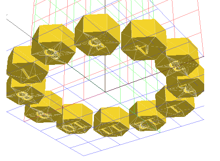

# Hidden Clockface Generator

This notebook builds a 3D model for a NeoPixel Ring clockface light diffuser

## Dependencies
* [OpenSCAD](https://openscad.org/)
* [solidpython](https://github.com/SolidCode/SolidPython)
* [viewscad](https://github.com/nickc92/ViewSCAD)

Let's import our dependencies


```python
import solid as s
import viewscad
```

And initialize the viewscad renderer


```python
r = viewscad.Renderer()
```

It's a commonly known requirment of baking apple pies that you must first define the universe, and a clockface is no different. This clockface definition builds off of 4 constants, defined below in millimeters.


```python
base_radius = 7.5    # Radius of the Individual Number Faces
num_height = 2       # Height of the number in the Number Face
shade_height = 1.5   # Thickness of the difuser
clock_height = 5     # Total Height/thickness of the clockface
```

The next 7 variables are simply derived from the initial constants


```python
hex_height = clock_height + 2           # Height of the number foace; has to be larger than the clock to make an opening through the base clockface shape
inner_radius = base_radius * 3          # Defines the radius of the donut hole in the clockface
between = base_radius * 2               # Defines the distance between inner and outer radii of the clockface
outer_radius = inner_radius + between   # Defines the total radius of the clockface, from center to edge
number_font_size = base_radius * 0.8    # Defines the font size of the number face
number_center_x_shift = number_font_size / 1.2
number_center_y_shift = -(base_radius * 0.8) / 2
```


```python
def build_face():
    return s.rotate([0, 0, 90])(s.cylinder(r=base_radius, h=hex_height, segments=6))
```


```python
def build_number_face(number):
    extruded_number = s.linear_extrude(num_height)(s.text(f"{number:2}", size=number_font_size))
    return s.rotate([0, 0, 90])(build_face() - s.translate([number_center_x_shift, number_center_y_shift, 0])(s.mirror([1, 0, 0])(extruded_number)))
```


```python
r.render(build_number_face(12))
```


```python
faces = sum([
    s.rotate([0, 0, i * -30])(
        s.translate([-4 * base_radius, 0, 0])(s.rotate([0, 0, i * 30])(
            build_number_face(i)))) for i in range(12, 0, -1)])
```


```python
r.render(faces)
```



```python
base = s.rotate_extrude(segments=256)(s.translate([inner_radius, 0, 0])(s.hull()(
    s.circle(r=clock_height / 4) +
    s.translate([between, 0, 0])(s.circle(r=clock_height / 4)) +
    s.translate([between, clock_height, 0])(s.circle(r=clock_height / 3)) +
    s.translate([0, clock_height, 0])(s.circle(r=clock_height / 3)))))
```


```python
clock = base - s.translate([0, 0, shade_height])(faces)

r.render(base - faces, outfile="HiddenClockface.stl")
```


