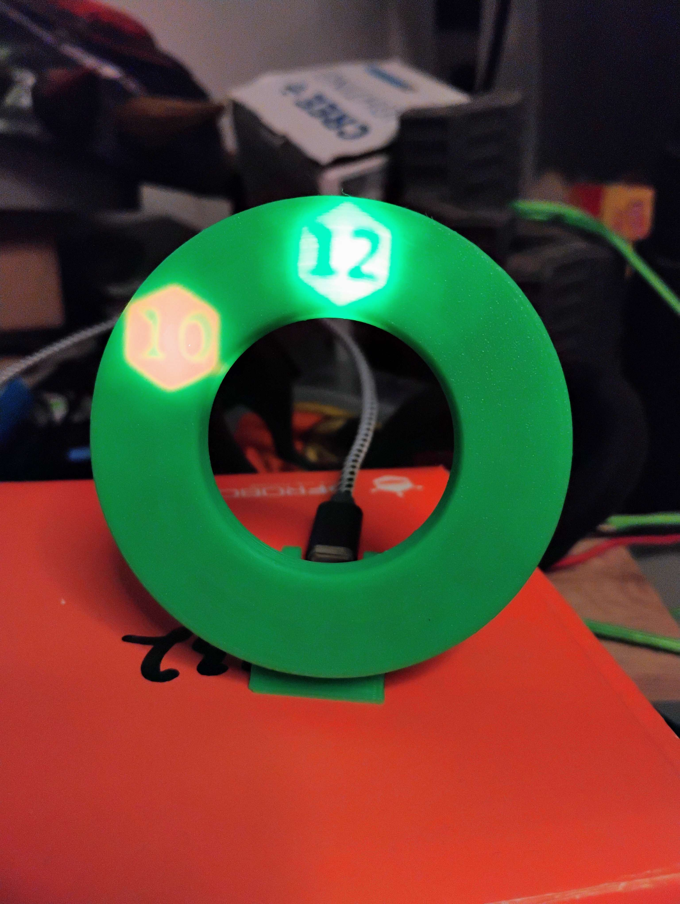

# [Hidden Clock](github.com/makurspace/hidden_clock)

This is a project to build clock. Driven by a ESP32C3, using a 3D printed light difuser and a NeoPixel LED ring, this clock will display the hour and minute as shadowed numbers in glowing hexagons.

### Working Example!

## External Parts

* [24x NeoPixel Ring](https://www.adafruit.com/product/1586)
  * A different ring could be used with if the Clockface Generator Notebook is appropriately configured. 
* [QT Py ESP32C3](https://www.adafruit.com/product/5405)
  * Pretty much any of the ESP32 QT Py's could run the firmware since it only needs 2 GPIO and an internal clock
 
## Code Dependencies

### [Clock Controller](clock.upy)
* [Micropython](https://micropython.org/)

### [Hidden Clockface Generator](HiddenClockfaceGenerator.md)
* [Jupyter](https://jupyter.org/)
* [OpenSCAD](https://openscad.org/)
* [solidpython](https://github.com/SolidCode/SolidPython)
* [viewscad](https://github.com/nickc92/ViewSCAD)

## Inspirations

I had been playing with lithophanes a lot ([such as those from the Lithophane Maker](https://lithophanemaker.com/)) and became enamored with how a thick-but-not-too-thick light difuser could cause an image to disappear without a backlight. The effect made static surfaces able to pop with hidden messages. I made some concept pieces out of wood that confirmed the basic idea. And then, toying with a NeoPixel ring one day, the idea of a light difuser based clock came together.

## Assembly Instructions

1. Print [Hidden Clockface](HiddenClockface.stl), [Clock Stomach](ClockStomach.stl) and [Embedded Button](EmbeddedButton.stl)
1. Load [clock.upy](clock.upy) firmware onto [Micropython formatted](https://micropython.org/download/ESP32_GENERIC_C3/) QT Py ESP32C3
1. Solder 3-wire connector cable from [24x NeoPixel Ring](https://www.adafruit.com/product/1586) to the [5V, GND, and M0 pins](https://learn.adafruit.com/adafruit-qt-py-esp32-c3-wifi-dev-board/pinouts) of the [QT Py ESP32C3](https://www.adafruit.com/product/5405)
       * Guarantee NeoPixel ring works and responds to both short and long button presses.
1. Glue [24x NeoPixel Ring](https://www.adafruit.com/product/1586) to [Clock Stomach](ClockStomach.stl)
1. Place [QT Py ESP32C3](https://www.adafruit.com/product/5405) into  [Clock Stomach](ClockStomach.stl) slot and solder-plasticweld the [Embedded Button](EmbeddedButton.stl) into place -- MINDFUL OF BUTTON PLACEMENT --
2. Solder/plasticweld [Hidden Clockface](HiddenClockface.stl) to [Clock Stomach](ClockStomach.stl) in front of [24x NeoPixel Ring](https://www.adafruit.com/product/1586)

## Control Instructions

* Short press (<200 milliseconds) adds a 3 minute modifier to the internal time
* Long press (>200 milliseconds) adds a 1 hour modifier to the internal time
